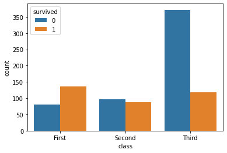
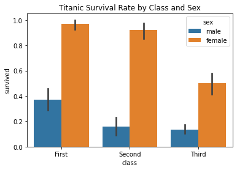
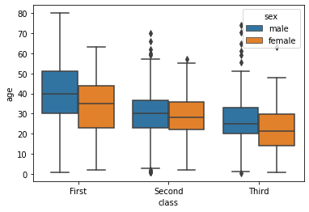

# Titanic Data Visualization Tutorial
Welcome to the **Titanic Passenger Data Visualization Guide**. This tutorial is designed to teach data exploration techniques using Python's **Seaborn** and **Matplotlib** libraries. By analyzing historical passenger records, we uncover critical patterns behind survival factors like ticket class, gender, and age.
## Dataset Overview
The dataset used is the famous **Titanic dataset**, directly loaded from Seaborn's built-in repositories. It includes demographic information and survival records of the passengers:* **survived**: Survival status (0 = No, 1 = Yes)* **class**: Ticket Class (First, Second, Third)* **sex**: Biological sex of the passenger* **age**: Age in years* **fare**: Passenger ticket price
## Python Code Implementation
Python source code into a file named `titanic_plots.py` and run it in your terminal or IDE

## Visualizations and Output Gallery
### 1. Count Plot (Passenger Demographics)This chart displays raw quantities. It clearly contrasts the number of casualties versus survivors within each ticket pricing tier.

### 2. Bar Plot (Survival Probabilities)Unlike raw counts, this bar chart measures categorical percentage rates. It effectively visualizes the historical reality of the "women and children first" maritime safety protocol across different socio-economic classes.

### 3. Box Plot (Age Range & Outliers)This box plot displays five-number statistical summaries. It helps you see the spread of age ranges across different classes, including median values and statistical outliers (represented by diamond points).

## Key Insights to Observe 

**The Wealth Gap**: Third-class passengers suffered the highest volume of total casualties compared to first-class travelers. 

**Gender Priority**: Across all three ticket tiers, female passengers maintained a significantly higher survival rate than male passengers. 

**Age Distributions**: First-class passengers generally skewed visually older than the younger average populations traveling within third class.

